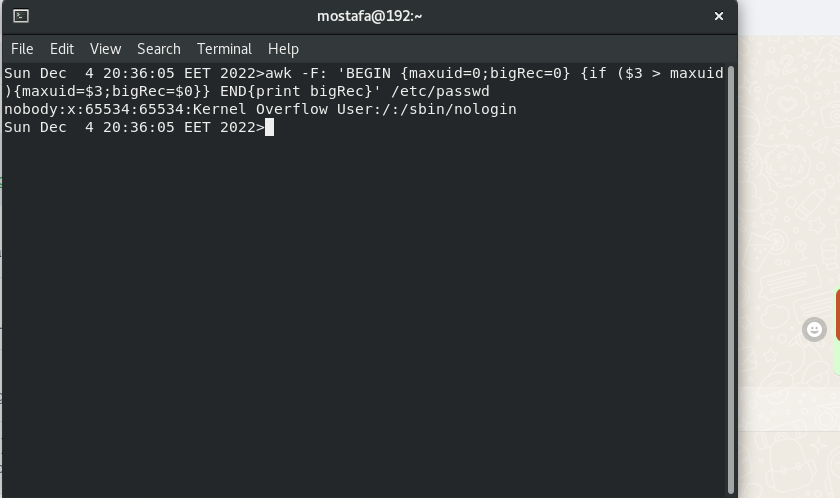

Display the lines that contain the word “lp” in /etc/passwd file.

Display /etc/passwd file except the third line.

Display /etc/passwd file except the last line.

Display /etc/passwd file except the lines that contain the word “lp”.

Substitute all the words that contain “lp” with “mylp” in /etc/passwd file.

Print full name (comment) of all users in the system.

Print login, full name (comment) and home directory of all users.( Print each line preceded

by a line number)

Print login, uid and full name (comment) of those uid is greater than 500

4- Print login, uid and full name (comment) of those uid is exactly 500

5- Print line from 5 to 15 from /etc/passwd

Change lp to mylp

Print all information about greatest uid.

Get the sum of all accounts id’s.

