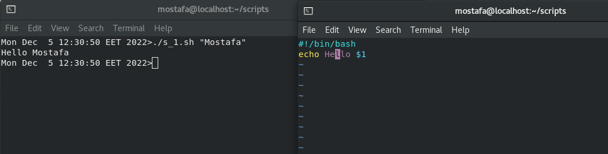
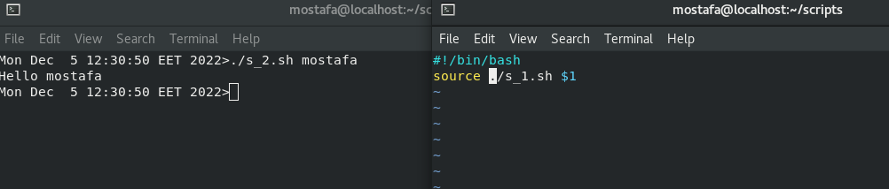
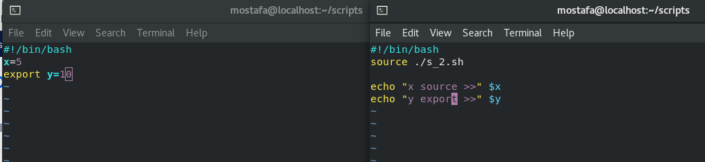
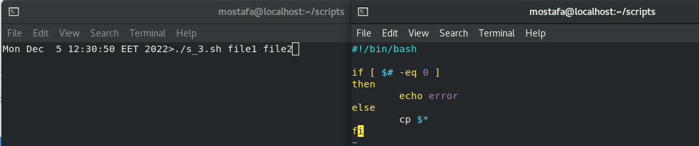
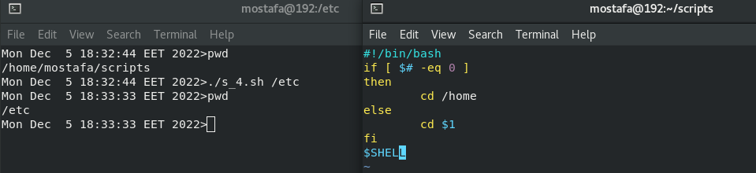
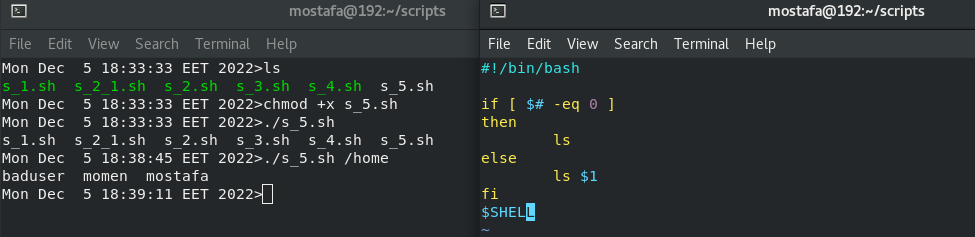
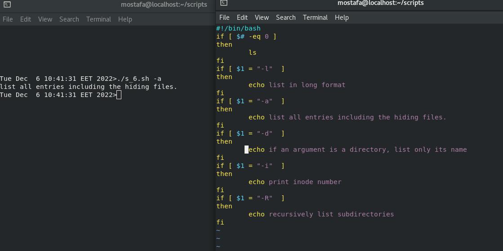
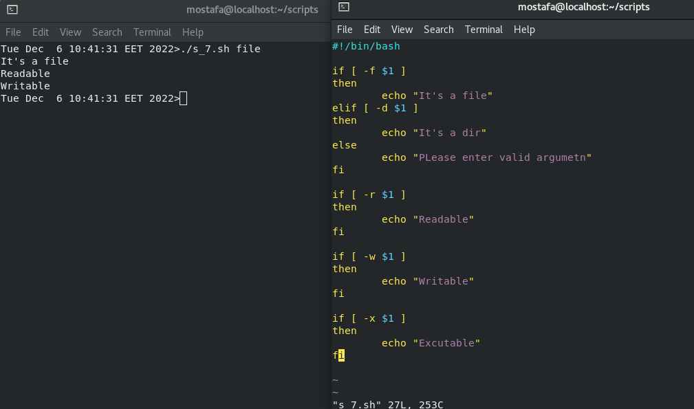
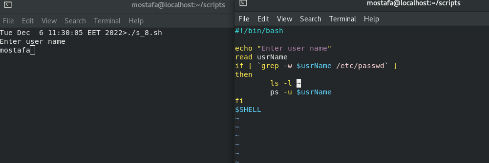

Create a script that asks for user name then send a greeting to him.

Create a script called s1 that calls another script s2 where:

In s1 there is a variable called x, it's value 5

Try to print the value of x in s2 by two different ways.

Create a script called mycp where:

a. It copies a file to another

b. It copies multiple files to a directory.

Create a script called mycd where:

a. It changed directory to the user home directory, if it is called without arguments.

b. Otherwise, it change directory to the given directory

Create a script called myls where:

a. It lists the current directory, if it is called without arguments.

b. Otherwise, it lists the given directory

Enhance the above script to support the following options individually:

a. –l: list in long format

b. –a: list all entries including the hiding files.

c. –d: if an argument is a directory, list only its name

d. –i: print inode number

e. –R: recursively list subdirectories

Create a script called mytest where:

a. It check the type of the given argument (file/directory)

b. It check the permissions of the given argument (read/write/execute)

Create a script called myinfo where:

a. It asks the user about his/her logname.

b. It print full info about files and directories in his/her home directory

c. Copy his/her files and directories as much as you can in /tmp directory.

d. Gets his current processes status.

