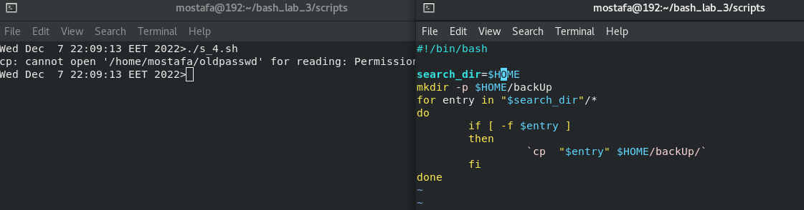
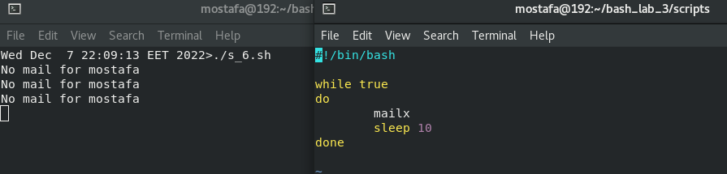
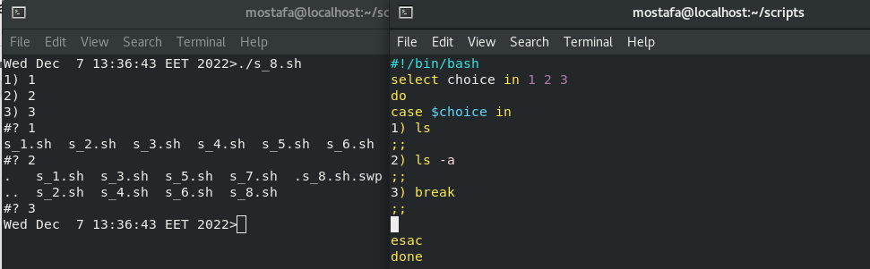

Write a script called mycase, using the case utility to checks the type of character

entered by a user:

a. Upper Case.

b. Lower Case.

c. Number.

d. Nothing.

Enhanced the previous script, by checking the type of string entered by a user:

a. Upper Cases.

b. Lower Cases.

c. Numbers.

d. Mix.

e. Nothing

Write a script called mychmod using for utility to give execute permission to all files and

directories in your home directory

Write a script called mybackup using for utility to create a backup of only files in your

home directory

Write a script called mymail using for utility to send mail to all users in the system.

Note: write the mail body in a file called template.

Write a script called chkmail to check for new mails every 10 seconds. Note: mails are

saved in /var/mail/username.

Create the following menu:

a. Press 1 to ls

b. Press 2 to ls –a

c. Press 3 to exit

Write a script called myarr that ask a user how many elements he wants to enter in an

array, fill the array and then print it.

Write a script called myavg that calculate average of all numbers entered by a user.

Note: use arrays

Write a function called mysq that calculate square if its argument.

